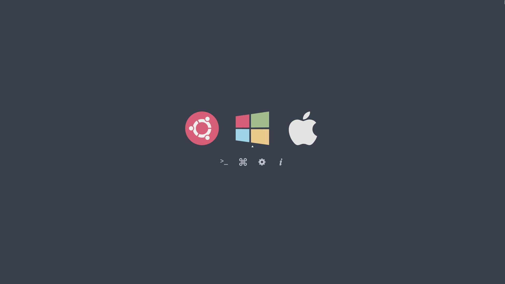

A clean theme for [the Clover UEFI bootloader](http://sourceforge.net/projects/cloverefiboot)
based on the Ursa Major colorscheme.

## Installation

1. Mount the EFI partition where Clover is installed. For me, it's /dev/sdb1:

```bash
sudo mkdir /mnt/macos
sudo mount /dev/sdb1
```

2. Clone this repository to your disk and copy to the Clover theme directory on
your EFI partition (/EFI/CLOVER/themes)

```bash
git clone https://github.com/kgoettler/ursa-major-clover.git
sudo cp -r ./ursamajor-clover /mnt/EFI/CLOVER/themes/
```

3. Edit your Clover config.plist (/EFI/CLOVER/config.plist) to select the theme.

```plist
<key>GUI</key>
<dict>
	<key>Theme</key>
	<string>ursamajor-clover</string>
</dict>
```

## Customization

By default, the Functions (e.g. About, Restart, and Shutdown) are disabled.
There are matching icons for these buttons, though, and they can be enabled
by modifying the `theme.plist` file:

```plist
<key>Functions</key>
<true/>
```

## Credits
Thanks to Alex James for the original [clover-theme-minimal](https://github.com/al3xtjames/clover-theme-minimal) theme,
which I used as a launching point for this theme.
